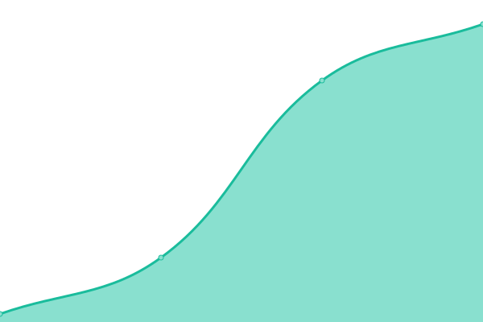
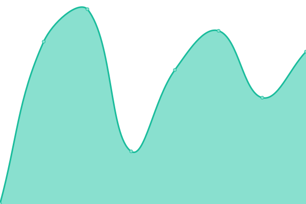

# [📈 Live Status](https://khs.status.migraine.kr): <!--live status--> **🟧 Partial outage**

This repository contains the open-source uptime monitor and status page for [편두통케어](https://migraine.kr/), powered by [Upptime](https://github.com/upptime/upptime).

With [Upptime](https://upptime.js.org), you can get your own unlimited and free uptime monitor and status page, powered entirely by a GitHub repository. We use [Issues](https://github.com/MigraineKR/khs.status/issues) as incident reports, [Actions](https://github.com/MigraineKR/khs.status/actions) as uptime monitors, and [Pages](https://khs.status.migraine.kr) for the status page.

<!--start: status pages-->
<!-- This summary is generated by Upptime (https://github.com/upptime/upptime) -->
<!-- Do not edit this manually, your changes will be overwritten -->
<!-- prettier-ignore -->
| URL | Status | History | Response Time | Uptime |
| --- | ------ | ------- | ------------- | ------ |
|  [headache.or.kr](https://www.headache.or.kr/index.php) | 🟩 Up | [headache-or-kr.yml](https://github.com/MigraineKR/khs.status/commits/HEAD/history/headache-or-kr.yml) | 

 2334ms
     
 | 

<a href="https://khs.status.migraine.kr/history/headache-or-kr">100.00%</a>
    

|  [migrainecluster.com](http://www.migrainecluster.com/) | 🟥 Down | [migrainecluster-com.yml](https://github.com/MigraineKR/khs.status/commits/HEAD/history/migrainecluster-com.yml) | 

 58ms
     
 | 

<a href="https://khs.status.migraine.kr/history/migrainecluster-com">0.00%</a>
    

|  [headache_m.one-page.co.kr](http://headache_m.one-page.co.kr/) | 🟥 Down | [headache-m-one-page-co-kr.yml](https://github.com/MigraineKR/khs.status/commits/HEAD/history/headache-m-one-page-co-kr.yml) | 

 772ms
     
 | 

<a href="https://khs.status.migraine.kr/history/headache-m-one-page-co-kr">0.00%</a>
    

<!--end: status pages-->

[**Visit our status website →**](https://khs.status.migraine.kr)

## 📄 License

- Powered by: [Upptime](https://github.com/upptime/upptime)
- Code: [MIT](./LICENSE) © [편두통케어](https://migraine.kr/)
- Data in the `./history` directory: [Open Database License](https://opendatacommons.org/licenses/odbl/1-0/)
